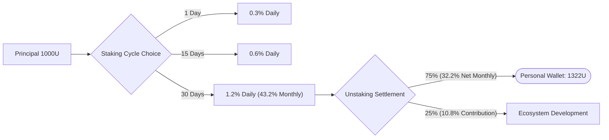
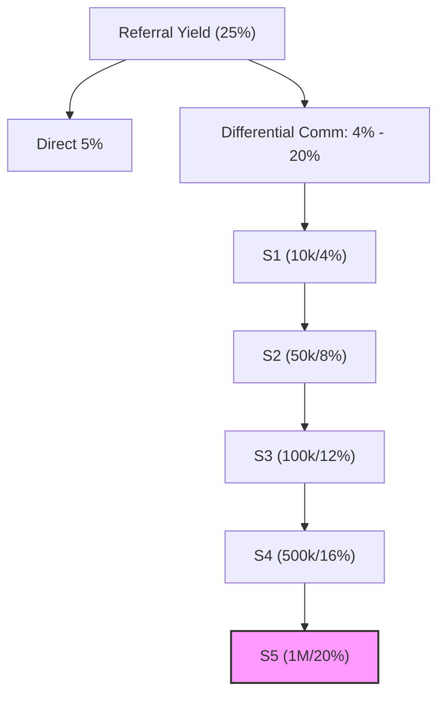
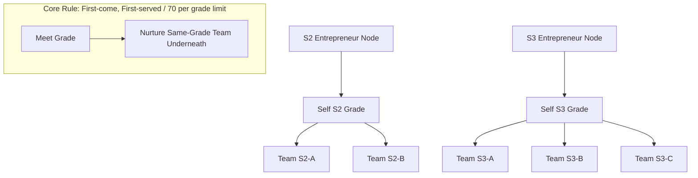
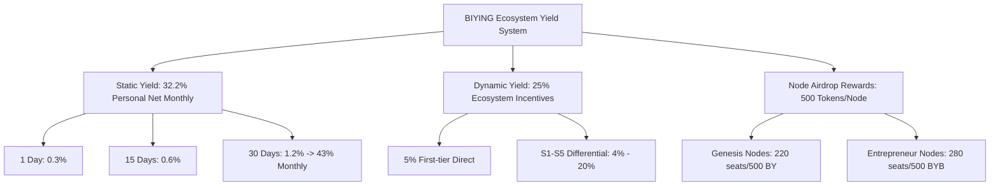
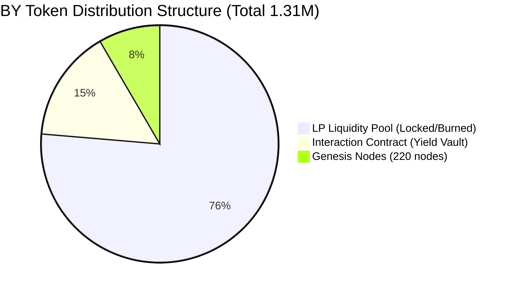
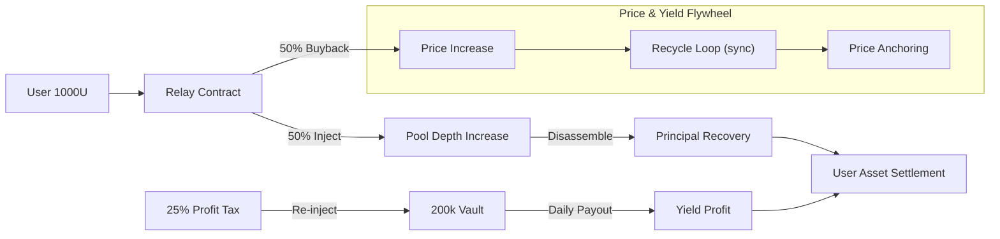

# BIYING: DeFi 4.0 On-chain Perpetual Wealth Management Platform

> **Core Philosophy**: Don't trust individuals, don't trust institutions; trust only algorithms, trust only mathematics.
> **Mission**: Return trust to logic; return finance to freedom.

---

## Prologue: An Algorithmic Revolution of "Trust"

We are currently in a magnificent paradigm shift of trust within the Web3 era. The core proposition of this revolution is simple: **to transform blind obedience to "people" into absolute trust in "algorithms."**

In traditional financial logic, risks often stem from human greed and institutional "black boxes." Today, we firmly believe that "Code is Law." The original intention behind the birth of **BIYING** was to reconstruct this defensive line. We are not just a protocol; we are a **DeFi 4.0 On-chain Perpetual Wealth Management Platform** characterized by **minimalist operation, ultimate security, and continuous yield.**

Here, your wealth is no longer subject to the will of any centralized authority; it dances only to mathematics and resonates only with algorithms.

---

## Part 1: Ultimate Security – The Foundation of Zero-Risk On-chain Finance

BIYING eliminates the possibility of human malice from its underlying code design, creating a "uncontrollable, permanently running" financial sanctuary. Its security logic has been verified by top global auditing firms and multifaceted community reviews.

### 1.1 The Three Iron Rules of Asset Security

- **Ownership Renounced**: Contract permissions have been destroyed, with the owner address set to `0x000...dead`. This means the team **cannot modify rules, cannot shut down the system, and cannot blacklist users**. Rules are eternal once launched.
- **LP Permanently Burned (99.98% Burned)**: 99.98% of the liquidity provider (LP) tokens have been sent to the "black hole" (null address).
- **Zero Team Budget (100% On-chain Flow)**: The team has **0 reservation**. They do not touch any user assets. 100% of all funds run within the public chain liquidity model, completely eliminating "ponzi" risks.

### 1.2 Third-Party Authority Audits and Full-Chain Transparency

The BIYING contract has undergone professional full-chain data analysis and authoritative audits.

- **Official Audit Report**: [BiYing Solidity Smart Contract Audit Report V2.0.pdf](https://github.com/ChowKwanhwa/biying/blob/main/%E8%B5%84%E6%96%99/%E5%AE%A1%E8%AE%A1%E6%8A%A5%E5%91%8A/BiYing%20Solidity%20Smart%20Contract%20Audit%20Report%20V2.0.pdf)

| [Ave Real-time Detection](https://ave.ai/token/0xd4713664b4997299bb41273432a77fbb44eed6dc-bsc?from=Home) | [GoPlus Security Detection](https://console.gopluslabs.io/token-security/56/0xd4713664b4997299bb41273432a77fbb44eed6dc) | [BscScan Token Distribution](https://bscscan.com/token/0xd4713664b4997299bb41273432a77fbb44eed6dc#balances) |
| :-------------------------------------------------------------------------------------------------------: | :----------------------------------------------------------------------------------------------------------------: | :-----------------------------------------------------------------------------------------------------------: |
|  |  |  |

---

### 1.3 Core Asset Distribution Details

Through verifiable on-chain addresses, the top three addresses are all **asset-locked/non-sell addresses**:

1. **No. 1 (LP Pool)**: PancakeSwap liquidity pool, serving as the global consensus liquidity foundation; no one can extract funds.
2. **No. 2 (Interaction Relay Contract)**: Locks **200,000 BY** specifically for user yield generation; the code logic is hardcoded and cannot be extracted.
3. **No. 3 (Black Hole Address)**: Burn address; assets have permanently exited circulation.

---

## Part 2: BIYING Comprehensive Yield System (Core Business Model)

BIYING utilizes a dual-token linkage model (BY + BYB), providing participants with wealth growth opportunities across three dimensions: Static, Dynamic, and Node rewards.

### 2.1 Static Yield: On-chain Perpetual Wealth Management

- **1-Day Period**: Daily interest rate of **0.3%** (High liquidity, redeem anytime).
- **15-Day Period**: Daily interest rate of **0.6%** (Steady growth, mid-term lockup).
- **30-Day Period (Core Recommendation)**:
    - Daily interest rate of **1.2%** -> Monthly cumulative growth of **43%**.
    - **Distribution Logic**: 75% of yield payout goes to the individual (Personal monthly net yield reaches **32.2%**), with the **remaining 10.8% going toward community ecosystem contributions.**
    - **Yield Example**: Invest 1,000 USDT; after 30 days, principal is 100% redeemable, with an additional yield of approximately 322 USDT.

#### Static Cycle and Yield Distribution Overview



### 2.2 Dynamic Yield: Ecosystem Sharing Incentives (25%)

- **Direct Recommendation Yield**: Receive **5%** of Tier 1 yield (based on referral's yield or investment amount).
- **Differential Rewards (S1 - S5)**:
| Team Grade | Verification Standard | Reward Ratio |
| :--------- | :-------------------- | :----------- |
| **S1**     | 10,000 USDT           | **4%**       |
| **S2**     | 50,000 USDT           | **8%**       |
| **S3**     | 100,000 USDT          | **12%**      |
| **S4**     | 500,000 USDT          | **16%**      |
| **S5**     | 1,000,000 USDT        | **20%**      |

#### S1-S5 Differential Reward Acceleration Model



### 2.3 Node Rewards: The Ultimate Dividend for Consensus-Builders

- **Total Liquidity Limit**: Limited to 500 seats worldwide.
- **Genesis Nodes (220 seats)**: Reserved for early core builders; each received an airdrop of 500 BY tokens (Sold out).
- **Entrepreneurial Nodes (280 seats)**: Currently open for application.
    - **How to Obtain**: Achieved through hierarchical fission (e.g., an S2 developing 2 other S2s, an S3 developing 3 other S3s, etc.).
    - **Dividend Rights**: **Extract 10x the total yield in BYB tokens (1% of the buy/sell slipage is specifically dedicated to weighted dividends for staking nodes).**

#### Entrepreneurial Node Requirement (Structure Diagram)



### Yield System Logic Summary Map



---

## Part 3: Core Technical Model – BY Contract, Interaction Contract, and Liquidity Pools

BIYING's success stems from its unique "Smart Relay" logic, which creates a positive flywheel where "staking equals buying pressure."

### 3.1 BY Tokenomics and the "Zero Reservation" Growth Miracle

- **Total Supply**: **1.31 Million (1.31M)** – Extremely scarce, extreme deflation.
- **Distribution Structure**:
    - **LP Pool**: 1 Million tokens (Locked status, 99.98% already burned/sent to black hole)
    - **Interaction Contract**: **200,000 tokens** (Dedicated to user staking output/exchange vault)
    - **Genesis Nodes/Rights**: 110,000 tokens
- **Transaction Slippage (5%)**: 3% for **Laboratory and Community Operations** + 1% Burn + 1% Node Rewards.

#### Core Growth Milestones

Since its launch, BIYING's pool size and price have achieved staggering exponential leaps:

| Metrics            | Launch (Genesis) | Current (Live) | Growth Factor |
| :----------------- | :--------------: | :------------: | :-----------: |
| **Pool Balance**   | 50,000 USDT      | 810,000 USDT   | 162x          |
| **Token Price**    | $0.05            | $0.97          | 19.4x         |

> **Future Roadmap**: When the price steadily breaks **10 USDT**, a secondary market buyback will be triggered by the contract, and BIYING will fully open up free global trading circulation.

| On-chain Real-time Detection Dashboard | $BY Token Detailed Parameters |
| :------------------------------------------------------------------------------------------------------: | :-------------------------------------------------------------------------------------------------------: |
|  |  |

#### Token Distribution Visualization



### 3.2 Interaction Contract (Relay) 50/50 Logic

For every 1,000 USDT staked, the contract automatically executes:

- **50% (500 USDT)**: Automatically swaps for BY on the DEX (creating real-time **buying pressure**, driving the price up).
- **50% (500 USDT)**: Retains USDT and pairs it with the purchased BY into an **LP Token** (increasing **pool depth**).

#### Technical Proof: On-chain Transaction Flow (Stake)
> **Verifiable Transaction**: [0x4266...3e52](https://bscscan.com/tx/0x426658b905e51a34df0e03ac3a327c6f3d2c29797b05c6b4863d06fbfb3d3e52)

````carousel

<!-- slide -->

````

### 3.3 Fund Source Settlement

- **Principal Settlement**: During unstaking, the contract automatically disassembles the LP position, ensuring high liquidity for principal recovery.
- **Yield Sustainability**: Interest is primarily derived from the linear release of the **200,000 tokens** locked in the vault, significantly bolstered by the **25% Profit Contribution (Profit Tax)** collected from all selling gains and redirected back into the rewards system.
- **Price Anchoring (Recycle Logic)**: The system utilizes a unique `recycle()` function (found in `BY.sol`) to pull $BY tokens from the liquidity pair and execute a `sync()`. This mathematically forces a price increase by reducing circulating supply and updating reserves without needing external buy volume.

#### Technical Proof: Liquidation & Reward Distribution (Unstake)
> **Verifiable Transaction**: [0xa2fa...a364](https://bscscan.com/tx/0xa2faaeb4ccc8f25058fc48934538c769c425ccfa114a349332126cb5edb3a364)

````carousel

<!-- slide -->

````



---

## Part 4: BIYING Vision – Reshaping the Financial Order 2026-2030

### 4.1 Project Values

- **No "Leeks" Throughout**: Through extreme deflation (burning from 1.31M to 310,000) and locked LP, we ensure there are no so-called "harvesters."
- **Algorithmic Trust**: Driving the transformation of the financial system from "Institutional Trust" to "Algorithmic Trust."

### 4.2 Strategic Goal Phases

- **3-Year Goal**: Accumulate 1 Million+ global wealth management participants to witness a new order together.
- **4-Year Goal**: Help **100,000 people** achieve the wealth milestone of **10 Million annual income**.
- **5-Year Goal**: Create a **100,000x value consensus** for the BY token, making it a benchmark-level scarce asset in the Web3 era.

### Conclusion

> **If you want to win, start by choosing BIYING!**
> This is a financial "nuclear peace" opportunity belonging to every ordinary person.

---

*Collated on: April 1, 2026*
*Data sources: BIYING Whitepaper, Business Plan, and On-chain Detection Reports*
