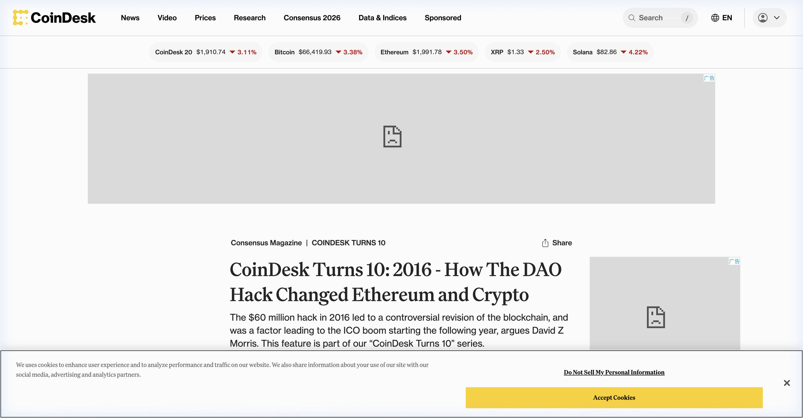
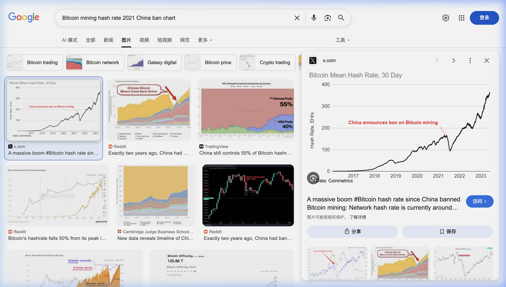
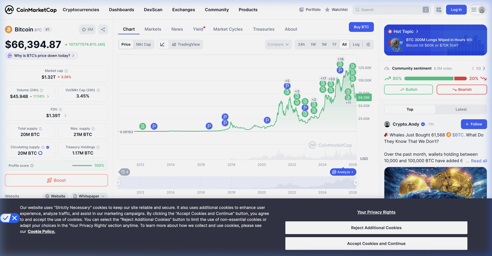
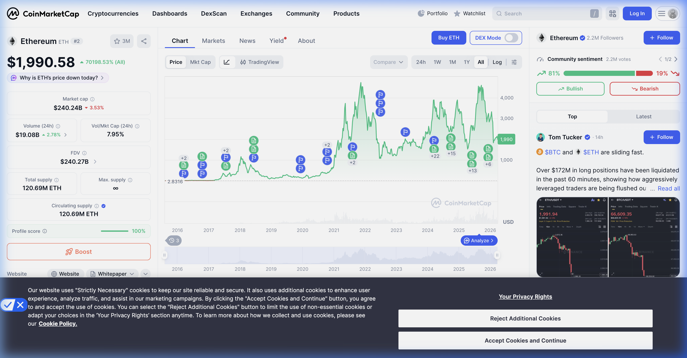

# 加密货币十年叙事：2015-2026 币圈重大事件(大事记)深度详考

## [纪元 0] 2015-2016：极客试验、DAO 之殇与算力霸权初现

**核心大事记：The DAO 黑客攻击 & 中国矿机军备竞赛（2015-2016 年）**

- **事件回放**：
  - **The DAO 劫难**：2016 年 6 月，当时最成功的众筹项目 The DAO（募集了全网 14% 的 ETH）被攻击。这场危机不仅是资金的损失，更是对“代码即法律”信仰的毁灭性打击。
  
  - **矿霸崛起**：在此期间，比特大陆（Bitmain）凭借 S7 和 S9 矿机统治了全球 70% 以上的算力。中国矿工（F2Pool, Antpool, BTC.top）形成了几大算力堡垒。
- **牛熊影响**：
  - **双元分裂**：以太坊通过硬分叉追回资金，引发了 ETH 与 ETC 的永久分裂。这让市场意识到，区块链的安全性并非绝对，而是社区共识的博弈。
  - **算力护城河**：中国算力的崛起使得 BTC 开始具备极强的“抗攻击性”，但也引发了后来关于中心化的剧烈争论。
- **代币表现**：ETH 经历了从 $1 到 $15 的巨震，最终在 2016 年底站稳 $8，为 2017 年的疯狂奠定了底层流动性。

---

## [纪元 1] 2017：ICO 癫狂、扩容内战与“9.4”大撤退

**核心大事记：ICO 众筹神话 & SegWit2x 废除 & 中国“9.4”禁令（2017 年全年度）**

- **事件回放**：
  - **代币经济学（Tokenomics）**：以太坊 ERC-20 协议引发了全球性的白皮书创业潮。即便由于缺乏实质业务，成千上万的项目依然能凭一份 PDF 募集数千万美元。
  - **扩容决战**：BTC 社区爆发了长达一年的扩容之争。纽约共识（SegWit2x）最终废除，UASF（用户激活软分叉）获胜，BTC 确立了“小区块、价值存储”的地位，随后 BCH 分叉诞生。
  - **中国 9.4 巨震**：2017 年 9 月 4 日，中国六部委定性 ICO 为非法非法融资。当晚大盘全线崩盘 30%。
- **牛熊影响**：
  - **出海纪元**：9.4 禁令不仅没杀掉加密货币，反而促使了币安（Binance）在短短半年内冲上全球第一。中国资本与项目方被迫“出海”，全球化交易网络正式形成。
  - **财富效应**：这一年产生了无数个“百倍币”，散户入场规模呈指数级增长。
- **代币表现**：BTC 触及 $19,891 的阶段顶点，山寨币市场膨胀到不可理喻的程度。

---

## [纪元 2] 2018-2019：泡沫清算、Libra 惊雷与“10.24”政策红利

**核心大事记：SEC 开启“豪威测试” & Facebook Libra 发布 & 中国“10.24”讲话（2018-2019）**

- **事件回放**：
  - **监管寒冬**：SEC 将大部分 ICO 项目列为未注册证券。这一时期，从 ICO 向 Staking（PoS 质押）的技术范式开始转移。
  - **Libra 震撼弹**：2019 年 6 月，Facebook 发布 Libra 白皮书。这一试图将 20 亿用户接入统一稳定币系统的计划，直接引发了 G7 国家的集体恐慌，被视为对“货币主权”的直接挑衅。
  - **中国 10.24 讲话**：2019 年 10 月 24 日，高层将区块链定位为“核心技术自主创新重要突破口”。
- **牛熊影响**：
  - **深熊洗礼**：2018 年是由于由于流动性枯竭导致的“无底洞”式下跌。BTC 跌至 $3,100，99% 的垃圾币从此归零。
  - **制度化的雏形**：Libra 事件倒逼了各国央行数字货币（CBDC）的研发，也确立了合规稳定币（如 USDC）的标准。
- **代币表现**：BTC 在 2019 年受 Libra 和 10.24 刺激最高反弹至 $14,000，随后因 Plus Token 崩盘而回落。

---

## [纪元 3] 2020：3.12 熔断、大放水与“乐高”金融（DeFi Summer）

**核心大事记：3.12 全球崩盘 & Compound 流动性挖掘 & 机构进场（2020 年）**

- **事件回放**：
  - **3.12 惨案**：受疫情冲击，BTC 在两日内从 $8,000 跌至 $3,800，全网爆仓额超百亿。
  - **DeFi 乐高**：Compound 开启流动性挖矿，随后 Uniswap V2, Aave, Curve 构成“金融乐高”，实现了链上借贷、交易与收益的闭环。
- **牛熊影响**：
  - **量化宽松红利**：美联储无限 QE 让加密货币成为了全球流动性的“溢油池”。BTC 叙事从“极客实验”正式升级为“数字黄金”。
  - **真实需求爆发**：DeFi Summer 让由于由于由于链上协议产生的真实利息首次超过中心化利息，吸引了第一波真正意义上的大型资本沉淀。
- **代币表现**：BTC 从年初 $7,000 到年底 $29,000，开启了跨年大牛市。

---

## [纪元 4] 2021：NFT 文化革命、马斯克效应与“5.19”矿业终局

**核心大事记：NFT 朋克时代 & 加密艺术家 Beeple & 中国“5.19”断根行动（2021 年）**

- **事件回放**：
  - **NFT 破圈**：Beeple 的作品拍出 6900 万美元，随后 Bored Ape (BAYC) 和 CryptoPunks 成为硅谷与娱乐圈的身份象征。
  - **GameFi 狂热**：Axie Infinity 开启“打金”模式，东南亚数万人以此为生。
  - **5.19 禁令**：中国突然宣布停止一切境内挖矿。
- **牛熊影响**：
  - **矿业西移**：5.19 之后，中国算力从全网 70% 跌至接近 0。大批矿工迁往德克萨斯州和哈萨克斯坦。这一举动客观上完成了 BTC 的“去中心化、绿色能源化、北美化”。
  
  - **ESG 争议**：马斯克因环保问题暂停 BTC 支付，引发了行业对“绿色溢价”的长期关注。
- **代币表现**：BTC 突破 $69,000。

---

## [纪元 5] 2022：算法螺旋崩溃与中心化信用全线爆雷

**核心大事记：LUNA/UST 坍塌 & 三箭资本破产 & FTX 帝国崩塌（2022 年 5-11 月）**

- **事件回放**：
  - **200 亿美金泡影**：算法稳定币 UST 脱锚，LUNA 归零。这一震动引发了“多米诺骨牌”效应。
  - **连环连环爆雷**：三箭资本（3AC）、Celsius、Genesis 相继破产。
  - **FTX 最终审判**：曾被誉为“加勒比之王”的 SBF 挪用资金被揭露，FTX 在一周内关停并破产。
  
- **牛熊影响**：
  - **信用危机**：整个 2022 年是由于由于由于由于中心化金融（CeFi）过度杠杆带来的“连环清算”。
  - **合并（The Merge）**：唯一的光亮是以太坊成功转为 PoS，大幅降低能源消耗。
- **代币表现**：BTC 跌至 $15,500，以太坊跌破 $900。

---

## [纪元 6] 2024-2026：现货 ETF 王者归来、L2 扩容与香港重回中心

**核心大事记：现货 ETF 开闸 & L2/L3 系割据 & 香港 Web3 新政（2024-2026 年）**

- **事件回放**：
  - **金字塔尖**：贝莱德 IBIT 等现货 ETF 获批，万亿级别养老金首次合规入场。
  - **扩容战争**：以太坊坎昆升级（EIP-4844）后，L2（Arbitrum, Optimism, Base）费用降至几乎为零，进入千万级 DAU 时代。
  - **香港复兴**：2024 年，香港不仅上线现货 ETF，还确立了 RWA（真实资产代币化）的监管路径。
  
- **牛熊影响**：
  - **机构统治力**：价格波动由 ETF 净流入主导。BTC 冲破 $126,000，成为国家主权基金的储备资产。
  - **AI + Crypto**：2025 年后，AI 的计算需求通过分布式协议（如 Render）完成，Web3 终于找到了除了金融之外的第二个大规模应用层。

---

### 十年大事记深度镜像表 (2015-2026)

| 纪元 | 核心驱动事件 | 关键人物/机构 | 核心逻辑/反身性 |
| :--- | :--- | :--- | :--- |
| **0** | The DAO Hack / 矿机大战 | Vitalik / 吴忌寒 | 信任分布式的开始 vs 算力的集权 |
| **1** | ICO 爆发 / 中国 9.4 | 李林 / 赵长鹏 | 全球融资民主化 vs 监管强制出海 |
| **2** | Libra 发布 / 中国 10.24 | 马克·扎克伯格 | 企业币冲击法币 vs 政策引导创新 |
| **3** | DeFi Summer / 3.12 | Hayden Adams | 代码银行 vs 全球流动性溢出 |
| **4** | NFT 破圈 / 5.19 禁令 | 马斯克 / 矿工群体 | 数字主权意识形态 vs 算力地理重启 |
| **5** | LUNA / FTX 崩溃 | Do Kwon / SBF | 算法死亡螺旋 vs 中心化信用破产 |
| **6** | 现货 ETF / AI 融合 | Larry Fink (贝莱德) | 合规金融巅峰 vs 算力实物上链 |

**写在最后：**
这十年的故事是“信任”的重构史。我们见证了信任从大公司（Meta/FTX）转向代码，又从代码转向合规机构（ETF）。2026 年的今天，加密货币已不再是挑战秩序的草莽，而是构建新秩序的底座。

### 附录：加密货币十年价格全景图 (2015-2026)

#### Bitcoin (BTC) 历史价格走势

#### Ethereum (ETH) 历史价格走势

