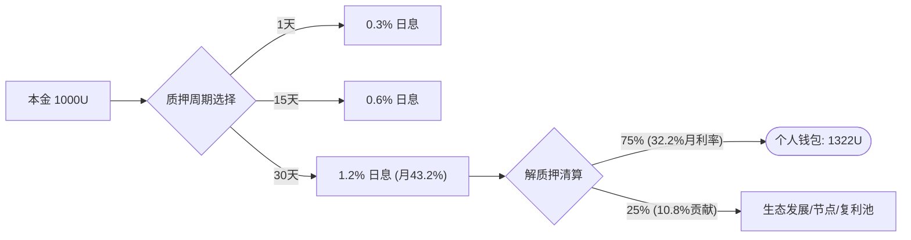
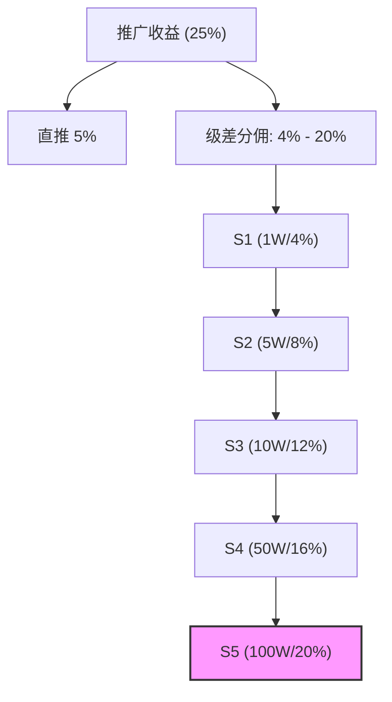
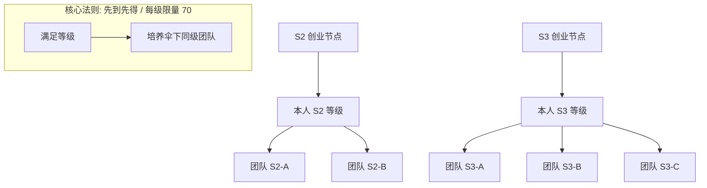
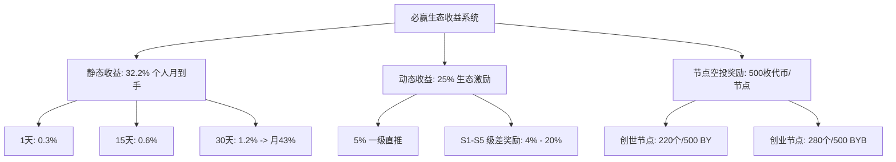
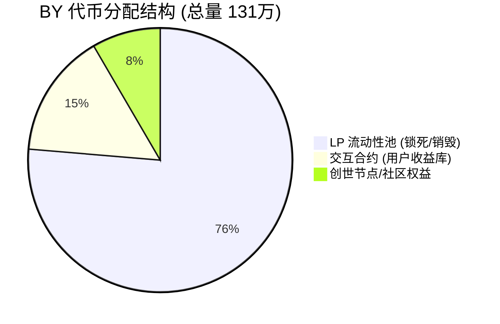
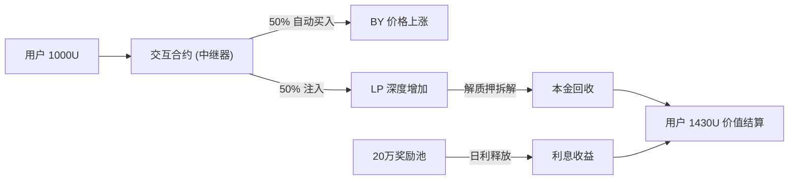

# 必赢 (BIYING)：DeFi 4.0 链上永续理财平台

> **核心哲学**：不相信个人，不相信机构，只相信算法，只相信数学。
> **使命**：让信任回归逻辑，让金融回归自由。

---

## 序言：一场关于“信任”的算法革命

我们今天所处的 Web3 时代，正在经历一场波澜壮阔的信任范式转移。这场革命的核心命题只有一个：**将对“人”的盲从，转变为对“算法”的绝对信任**。

在传统的金融逻辑中，风险往往源于人性的贪婪与机构的黑箱。而今天，我们坚信“代码即法律 (Code is Law)”。**必赢 (BIYING)** 诞生的初衷，正是为了重构这道防线。我们不仅仅是一个协议，更是一个**极简操作、极致安全、持续收益**的 **DeFi 4.0 链上永续理财平台**。

在这里，你的财富不再受制于任何中心化权威的意志，它只随数学起舞，随算法共鸣。

---

## 第一部分：极致安全 —— 零风险的链上金融基础

必赢从底层代码设计上杜绝了人为作恶的可能性，打造了一个“无人可控、永久运行”的金融净土。其安全逻辑经过全球顶级审计机构及社区多方验证。

### 1.1 资产安全三大铁律
- **权限丢弃 (Ownership Renounced)**：合约权限已销毁，owner 地址为 `0x000...dead`。这意味着团队**无法修改规则、无法关闭系统、无法黑名单用户**，规则一旦上线即永恒。
- **LP 永久销毁 (99.98% Burned)**：99.98% 的流动性凭证已打入黑洞。
- **零团队预算 (100% On-chain Flow)**：团队 **0 预留**，不触碰任何用户资产，所有资金 100% 运行在公链流动性模型中，彻底告别“资金盘”风险。

### 1.2 全球顶尖审计与全链透明（资产及流动性验证）

| [Ave 实时检测](https://ave.ai/token/0xd4713664b4997299bb41273432a77fbb44eed6dc-bsc?from=Home) | [GoPlus 安全检测](https://console.gopluslabs.io/token-security/56/0xd4713664b4997299bb41273432a77fbb44eed6dc) | [BscScan 持币分布](https://bscscan.com/token/0xd4713664b4997299bb41273432a77fbb44eed6dc#balances) |
| :---: | :---: | :---: |
|  |  |  |

---

### 1.3 核心资产分布说明
通过全链可查地址证明，前三名地址均为**资产锁定性/非抛售地址**：
1. **No.1 (LP 池)**：薄饼流动性池，属于全球共识流动性底座，任何人无法提取。
2. **No.2 (中继交互合约)**：锁定 **200,000 BY** 专门用于用户收益产出，代码逻辑写死无法提取。
3. **No.3 (黑洞地址)**：销毁地址，资产已永久退出流通。

---

## 第二部分：必赢全方位收益体系 (核心商业模型)

必赢采用（BY + BYB）双币联动模型，通过静态、动态与节点三大维度，全方位保障参与者的财富增长空间。

### 2.1 静态收益：链上永续理财
- **1 天期**：日利率 **0.3%**（极速流动，随时赎回）。
- **15 天期**：日利率 **0.6%**（稳健增值，中期锁定）。
- **30 天期 (核心推荐)**：
    - 日利率 **1.2%** -> 单月累计增长 **43.2%**。
    - **分配逻辑**：收益支出的 75% 归个人（个人月到手收益率达 **32.2%**），剩余 10.8% 归属于社区生态贡献。
    - **收益举例**：投入 1000U，30 天后本金 100% 提取，额外获得约 322U 收益。

#### 静态周期与收益分配概览

### 2.2 动态收益：生态分享激励 (25%)
- **直推收益**：享有一级收益的 **5%**（基于下级收益或投入金额）。
- **级差奖励 (S1 - S5)**：
    | 团队等级 | 考核标准 | 奖励比例 |
    | :--- | :--- | :--- |
    | **S1** | 10,000 USDT | **4%** |
    | **S2** | 50,000 USDT | **8%** |
    | **S3** | 100,000 USDT | **12%** |
    | **S4** | 500,000 USDT | **16%** |
    | **S5** | 1,000,000 USDT | **20%** |

#### S1-S5 级差奖励加速模型

### 2.3 节点奖励：共识者的终极分红
- **总量限制**：全球仅限 500 个席位。
- **创世节点 (220个)**：专属于早期核心建设者，每人空投 500 枚 BY（已抢完）。
- **创业节点 (280个)**：开放申请中。
    - **获取方式**：通过级差裂变（如 S2 发展 2 个 S2，S3 发展 3 个 S3 等）获得，每人空投 500 枚 BYB。
    - **分红权**：加权平分 BYB 交易手续费池（买/卖滑点中 1% 专供节点分红）。

#### 创业节点获取条件 (伞状结构示意)

### 收益系统逻辑总结图

---

## 第三部分：核心技术模型 —— BY 合约、交互合约与流动性池

必赢的成功源于其独创的“智能中继器”逻辑，实现了“质押即买压”的正向飞轮。

### 3.1 BY 代币经济学与“零预留”增长奇迹
- **总量控制**: **131 万枚 (1.31M)** —— 极度稀缺，天然通缩。
- **分配结构**:
  - **LP 池资金**: 100 万枚 (锁定状态，99.98% 已销毁/打入黑洞)
  - **交互合约**: **20 万枚** (专用于用户质押产出/兑换库)
  - **创世节点/权益**: 11 万枚
- **交易滑点 (5%)**: 3% 本金支撑/持有分红 + 1% 销毁 + 1% 节点奖励。

#### 核心成长指标 (Growth Milestones)
必赢项目自启动以来，底池与价格均实现了惊人的指数级跨越：
| 指标项 | 启动初期 (Genesis) | 当前实测 (Live) | 增长倍率 |
| :--- | :--- | :--- | :--- |
| **底池金额** | **5,000 USDT** | **810,000 USDT** | **162 倍** |
| **代币价格** | **$0.05** | **$0.97** | **19.4 倍** |

> **未来规划**：当币价稳步突破 **10 USDT** 核心技术关口时，必赢将全面开放全球范围内的自由交易流通。

| 链上实时检测看板 | $BY 代币详细参数 |
| :---: | :---: |
|  |  |

#### 代币分配可视化

### 3.2 交互合约（中继器）的 50/50 逻辑
每一个 1000U 的质押入金，合约会自动执行：
- **50% (500U)**：自动在 DEX 兑换成 BY（产生实时**买压**，推高币价）。
- **50% (500U)**：保留 USDT，并与买入的 BY 组建为 **LP 凭证**（增加**底池深度**）。

### 3.3 资金来源清算
- **本金清算**：解质押时，合约自动拆解 LP 释放资产。
- **利息来源**：主要源于交互合约内锁定的 **20 万枚生态奖励池** 的线性释放，辅以 1% 交易费的持续回流。

---

## 第四部分：必赢愿景 —— 重塑金融秩序 2026-2030

### 4.1 项目价值观
- **全程无韭菜**：通过极致通缩（131万销毁至31万） and LP 锁死，确保没有所谓的“收割者”。
- **算法信任**：推动金融体系从“机构信任”转向“演算法信任”。

### 4.2 阶段性战略目标
- **三年目标**：累积 100 万+ 全球理财参与者，共同见证新秩序。
- **四年目标**：帮助 **10 万人** 迈向 **年收入 1000 万** 的财富里程碑。
- **五年目标**：打造 BY 代币 **10 万倍价值共识**，成为 Web3 时代的标杆级稀缺资产。

### 结语
> **想赢，从选择必赢开始！**
> 这是属于每一个普通人的金融核平契机。

---
*整理日期：2026-04-01*
*数据源：必赢白皮书、商业计划书及全链检测报告*
