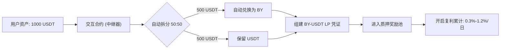
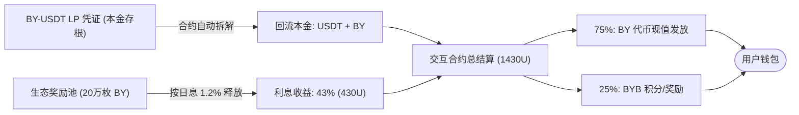

# BY 项目：交互合约（中继器）运行机制详解

在 BY 的 DeFi 4.0 模型中，**交互合约 (Interaction Contract)** 扮演着“智能中继器”的核心角色。它负责自动化处理资金的拆分、兑换、组建流动性以及最终的收益结算，确保整个过程无需人工干预且透明安全。

---

## 一、 质押流程：当用户投入 1000 USDT 时

当用户向合约发起质押指令并投入 **1000 USDT** 时，交互合约内部会立即触发以下自动化步骤：

1.  **资金切割**: 合约将 1000 USDT 自动拆分为两个 **500 USDT** 的等额部分。
2.  **自动兑换 (Swap)**: 第一部分（500 USDT）在链上自动兑换为等值的 **BY 代币**。
3.  **流动性组建 (Add Liquidity)**: 合约将兑换出的 BY 与剩余的第二部分（500 USDT）进行配对，组建为 **BY-USDT LP 流动性凭证**。
4.  **底层锁定**: 这些 LP 凭证随即进入项目的底层质押池，作为产生复利收益的资产底座。

### 质押逻辑流程图 (Mermaid)

---

## 二、 交互合约的角色定位

-   **效率工具**: 用户无需手动去 DEX 购买 BY 或手动组建 LP，一键完成复杂操作。
-   **价值锚定**: 每一笔入金都强制性地为 BY 提供了 50% 的实盘买压（兑换 BY）和 50% 的流动性支撑（组建 LP），确保价格稳步上行。
-   **信任屏障**: 合约权限已丢弃，资产流程由代码写死，避免了项目方人为挪用资金的风险。

---

## 三、 解质押流程：资产如何回流？

当质押周期结束（如 30 天期满），用户发起提取请求时，交互合约会执行精准的价值结算。许多用户关心“本金从哪来”以及“利息怎么发”，其底层逻辑如下：

### 1. 本金回收 (Principal Retrieval)
- **来源**: 初始质押时组建的 **BY-USDT LP 流动性凭证**。
- **操作**: 交互合约自动向流动性池申请“解散 LP”。此时，原本锁定在池子里的 **500 USDT** 和 **对应价值的 BY 代币** 会回流到合约待分配区。
- **价值支撑**: 由于入金时有 500U 的直接买盘，加上 LP 机制的汇率波动，回流的 BY 代币通常已具备更高的市场溢价。

### 2. 利息/收益来源 (Interest Sourcing)
- **来源一：生态奖励池 (Eco-Reward Vault)**: 正是中继合约中锁定的 **200,000 枚 BY 代币**。这部分筹码专为用户质押收益预留，按日利率（0.3%-1.2%）进行线性释放。
- **来源二：交易税收补位**: 交易滑点中 1% 的分红激励也会不断注入奖励池，确保收益的持续性。
- **结算**: 1000U 增长至 **1430U** 的额外 430U 价值，即由上述奖励池补足。

### 3. 最终支付 (Final Payout)
合约按 **75% (BY 现值) + 25% (BYB 积分/代币)** 的比例将总价值（1430U）发放至用户钱包。

### 解质押逻辑流程图 (Mermaid)

---

## 四、 总结

交互合约不仅是资产的**搬运工**，更是 BY 生态价格发现的**引擎**。它通过“质押即买压、质押即流动性”的逻辑，确保了每一位参与者的入金都在实质性地推高代币价值，并为后续的复利产出提供坚实的数学基础。

---
*记录日期：2026-04-01*
*BY 生态技术文档*
