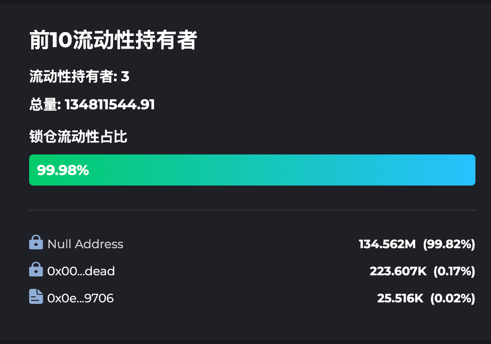
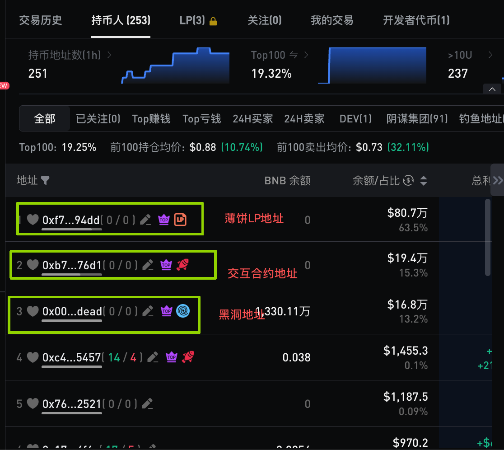
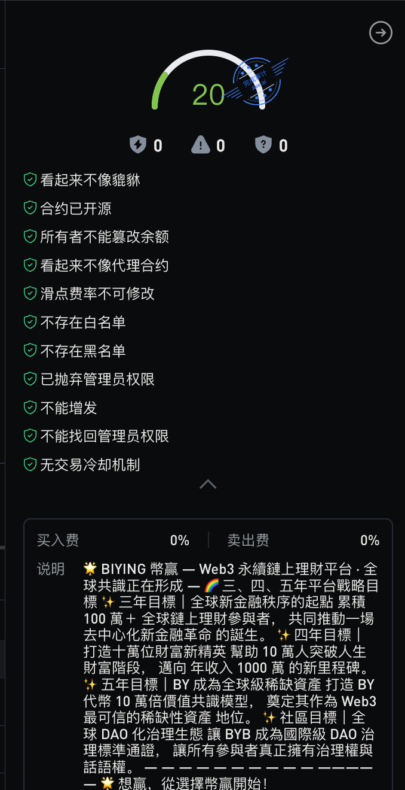
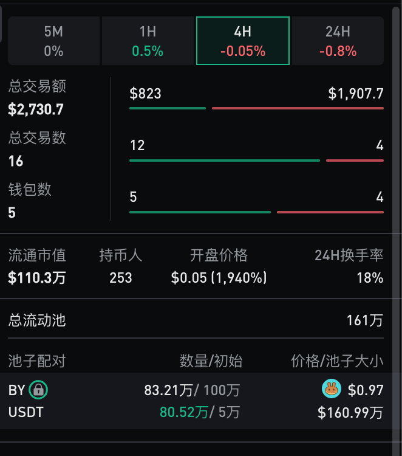

# BY 代币合约风险总结与防砸盘分析报告

本报告旨在从技术层面分析 BY 代币的合约安全性，评估其防范 **Rug Pull (撤池逃跑)** 及 **Dump (恶意抛售)** 的能力。基于链上数据与第三方安全检测结果，BY 项目表现出极高的去中心化与资产安全性。

---

## 一、 执行概要 

- **代币合约**: `0xd4713664b4997299bb41273432a77fbb44eed6dc`
- **审计状态**: 合约权限已完全丢弃 (Renounced)。
- **安全评级**: **极高安全 (Extreme Security)**。
- **核心支撑**:
  - 99.98% 的流动性资源已被永久锁定/销毁。
  - 持币结构透明，前三名地址均为非抛售性质地址。

---

## 二、 Rug Pull (撤池逃跑) 可行性与可能性分析

**结论：理论上不可能发生 Rug Pull。**

### 1. 流动性 (LP) 锁定情况

根据 GoPlus Security 及 BscScan 实时数据，BY 的流动性池代币 (LP Tokens) 锁定比例高达 **99.98%**。

- **锁定方式**: 99.98% LP 代币已打入黑洞地址 (`0x0...dead` 和 `0x0...000`)。
- **安全意义**: 这意味着项目方无法通过提取流动性（撤池）的方式抽走资金，池底资产完全公有化，无法被恶意撤销。

### 2. 权限丢弃情况

合约的所有权已被转移至 `0x0...dead` 地址。

- **安全意义**: 开发者不再具备修改交易税、暂停交易或随意解开 LP 锁定的权限，彻底杜绝了后期通过合约逻辑进行恶意操纵的可能性。

---

## 三、 Dump (恶意抛售) 可行性与可能性分析

**结论：核心筹码高度锁定，大额抛售风险极低。**

### 1. 持币地址分布分析

通过对前几名大户地址的身份核实，筹码分布呈现出极强的稳定性：

| 排名           | 地址类型                   | 角色定位     | 持币量               | 备注                                                                             |
| :------------- | :------------------------- | :----------- | :------------------- | :------------------------------------------------------------------------------- |
| **No.1** | **PancakeSwap LP池** | 流动性汇聚点 | ~73万 BY             | 属于全社区共享流动性，不可被单方面提取。                                         |
| **No.2** | **交互合约**         | 生态业务核心 | **200,000 BY** | 该合约内含 20 万固定代币，仅用于业务逻辑，**无法提取至外部钱包进行抛售**。 |
| **No.3** | **黑洞地址 (Dead)**  | 销毁接收点   | ~17万 BY             | 已销毁部分，永远退出流通。                                                       |

### 2. 防砸盘机制简述

由于排名前三的地址（占总供应量绝大部分）均不具备向二级市场抛售的能力，市场上流通的“活动筹码”总量极其有限。即便有散户抛售，由于 1% 的交易销毁与 1% 的节点奖励机制，抛售行为反而会反哺生态，加速代币通缩。

---

## 四、 第三方工具检测结果

利用业界多方安全工具（如 Ave, GoPlus, Honeypot.is）进行综合扫描，结果均显示一致：

- **无隐藏税收**
- **无黑名单功能**
- **无增发权限**

---

## 五、 最终评测结论

BY 合约在底层逻辑上实现了“自驱运行”：

1. **资产锁定**: 99.98% 的 LP 销毁确保了资金盘位的稳固。
2. **筹码固化**: 核心的 20 万代币锁定在交互合约内，消除了最大的“庄家砸盘”隐忧。
3. **去中心化**: 权限丢弃标志着项目已进入纯粹的社区共识阶段。

**BY 项目在抗风险等级上达到了同类 DeFi 项目的最高标准。**

---

*报告生成时间：2026-04-01*
*数据来源：BscScan, GoPlus Labs, Ave.ai*
