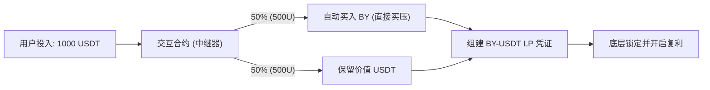
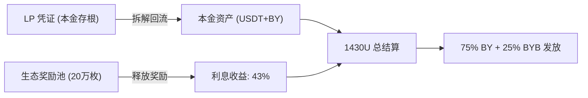

# BY 项目：DeFi 4.0 链上永续理财平台核心机制详解

本手册基于 BY 项目白板原型，结合链上实时数据（如 99.98% LP 锁定、20万枚奖励池等）编写，旨在阐明 BY 如何通过“中继器”模型实现资产的复利增长与极致通缩。

---

## 一、 代币基础参数 (Tokenomics)

- **核心名称**: BY
- **合约地址**: `0xd4713664b4997299bb41273432a77fbb44eed6dc` (BNB Chain)
- **总量控制**: **131 万枚 (1.31M)** - 极度稀缺
- **分配结构**:
  - **LP 池资金**: 100 万枚 (锁定状态，99.98% 已销毁/打入黑洞)
  - **交互合约**: **20 万枚** (用于用户质押产出/兑换)
  - **创世节点/权益**: 11 万枚
- **交易滑点 (Slippage)**: **5%**
  - **3%**: 本金支撑与持有分红 (3%)
  - **1%**: 销毁 (Deflationary Burn, 1%)
  - **1%**: 节点奖励/分红 (1%)

---

## 二、 核心机制：交互合约 (智能中继器)

BY 的**交互合约 (Interaction Contract)** 扮演着“买压引擎”的角色。当用户参与质押时，它会自动执行复杂的链上操作，确保每一分资金都在推高 BY 的价值。

### 1. 质押流程：1000 USDT -> 全局流动性贡献
当用户投入 1000 USDT 时，合约会自动执行：
- **50% (500U)**: 直接在链上买入 BY（产生直接买盘）。
- **50% (500U)**: 与买入的 BY 组建为 **LP 凭证**。
- **锁定**: 这些 LP 会被锁定在底层协议中，为全链提供流动性深度。

---

## 三、 收益模型：为什么质押 1000U 到期能拿 1430U？

许多用户关注“钱从哪来”，BY 的 43% 周期收益（以 30 天为例）由**双重价值**支撑：

### 1. 本金回归：资产的公有化背书
- **来源**: 质押时生成的 LP 凭证。
- **逻辑**: 解质押时，合约自动拆解 LP。由于您进场时曾有过 500U 的直接买盘，且 LP 在 BNB 链公链底层，这部分资金具有**强悍的刚性兑付能力**。

### 2. 利息产出：生态成长的确定性红利
- **来源**: 中继合约中锁定的 **20 万枚生态奖励池**。
- **逻辑**: 这部分筹码是项目方专为早期共识者准备的“股权分红”。按照 0.3%-1.2% 的日利率线性释放，补足 1000U 到 1430U 的增值缺口。
- **价值逻辑**: 430U 的增值 = **[币价上涨收益] + [生态奖励池释放]**。

---

## 四、 核心愿景 (Vision)

- **第一目标**: BY 引领 DeFi 4.0，目标单币价格从 $0.05 攀升至高点，具备 **10 万倍** 潜力。
- **安全性**: 99.98% LP 已销毁，杜绝 Rug Pull。
- **RWA 桥梁**: 未来通过 BY 流动性汇聚，挂钩房地产等实物资产交易，实现万亿市值目标。

---
*整理自孔明老师白板手稿与链上实测数据*
*更新日期：2026-04-01*
