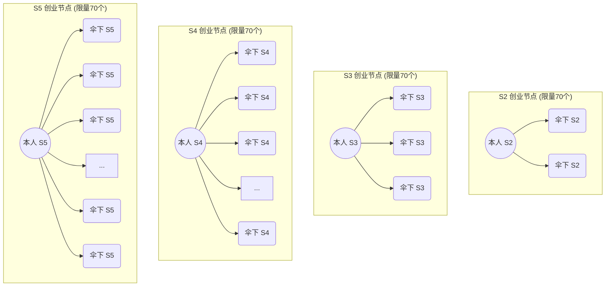

# 必赢 (BY + BYB) 双币联动模型白板记录

根据白板照片整理的内容如下：

## 一、 理财模型 (BY + BYB 双币联动模型)

### 1. 收益静态 (质押/理财)

- **① 1天期**：0.3%/天
- **② 15天期**：0.6%/天
- **③ 30天期**：1.2%/天 × 30天 = **43.2%/月** (解质押时本金100%返还，收益部分个人拿75%（即个人月到手收益率为 **32.2%**），剩余25%反馈给社区)

### 2. 收益举例 (以 1000U 为例)

- **投入**：1000U
- **30天周期**：
  - **总增长**：1.2%/天 × 30天 = **43.2%** (即 432U)
  - **分配逻辑**：个人拿收益的 75%，社区拿 25%
  - **个人部分**：432U × 74.5% ≈ **322U** (以白板注记 32.2% 为准)
  - **最终到手**：1000U (本金) + 322U (收益) = **1322U**

---

## 二、 社区奖励机制 (动态)

### 1. 直推收益

- **比例**：5% (基于下级收益或投入)

### 2. 级差奖励 (S1 - S5)

| 等级         | 考核条件/人数 | 奖励比例 |
| :----------- | :------------ | :------- |
| **S1** | 1万美金       | 4%       |
| **S2** | 5万美金       | 8%       |
| **S3** | 10万美金      | 12%      |
| **S4** | 50万美金      | 16%      |
| **S5** | 100万美金     | 20%      |
|              |               |          |

### 3. 节点奖励

- **总量控制**：500个节点
  - **创世节点**：220个 (已满额，每人 500 个 BY) —— 向 **必赢** 早期建设者致敬。
  - **创业节点**：280个 (开放中，每人 500 个 BYB) —— 获得方式如下：
- **获得方式 (创业节点)**：
  - **S2 节点**：个人达 S2，伞下有 2 个 S2 (限量 70 个)
  - **S3 节点**：个人达 S3，伞下有 3 个 S3 (限量 70 个)
  - **S4 节点**：个人达 S4，伞下有 4 个 S4 (限量 70 个)
  - **S5 节点**：个人达 S5，伞下有 5 个 S5 (限量 70 个)
  - **规则**：每层级限量 70 个，先到先得。
- **分红来源**：BYB 交易手续费池（买/卖均为 5**%**，其中1%用户分配个节点）
- **分配逻辑**：全网节点加权平分（个人分红 = 总手续费池 × 个人节点数 / 全网节点总数）。

#### 创业节点结构示意图

---

## 三、 其他核心词汇

- **BY + BYB**：双链/双币联动模型。
- **回本周期**：约 3个月 (白板注记)。
- **滚存预期**：3倍、10倍增长路径。
